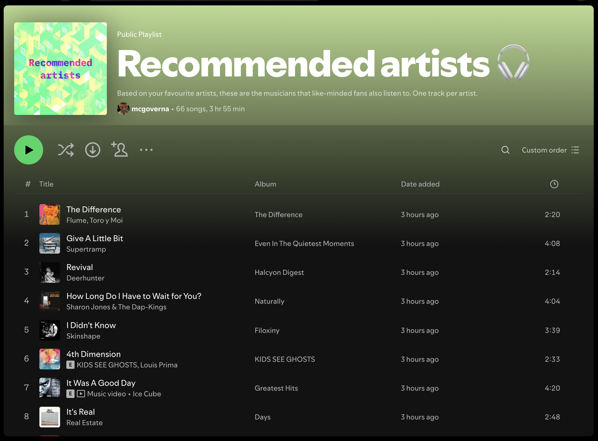

# Artist recommendation engine for Spotify: playlist generator 🎧

This project is a Python-based tool which generates a Spotify playlist with personalized artist recommendations. 

It connects user's top Spotify artists data with the more comprehensive MusicBrainz/ListenBrainz dataset, to fetch similar artists for each artist on user's list. ListenBrainz's similar artist designation is based on additional artists listened to by other users who also play the original seed artist in the same session. Subsequently the tool returns to Spotify API to extract each recommended artist's top song as a sample of their work and outputs a Spotify playlist, automatically added to user's library.

[Spotify playlist: Recommended artists 🧠](https://open.spotify.com/playlist/7JbjUVGzu2E6H8xffw4jzG?si=d92c9844dfb84b29)


## Features
* Fetches user's top 100 artists from Spotify API
* Maps Spotify artist IDs to MusicBrainz IDs (MBID) by extracting Spotify ID from free streaming links within artist url table [(Schema)](https://musicbrainz.org/doc/MusicBrainz_Database/Schema%23Artist#Overview)
    * CSV output of 100-artist longlist with MBID, Spotify ID: 'artists_with_mbids.csv'
* Extracts similar artists for user's top 50 artists using the ListenBrainz API
* References similar artists against original 100-artist longlist to remove existing artists
* Fetches top song for every recommended artist remaining as a sample of their work
    * CSV output of list of similar artists and tracks with Spotify IDs: 'similar_artists_results.csv'
* Creates Spotify playlist with top tracks from recommended artists
* Spotify playlist "Recommended artists 🎧" added to user's Spotify library

## User need
Common and well-documented user need within music discovery: "I want to discover more artists who are similar to those I already listen to"

## Tools used
Spotify developer platform, Spotify API, MusicBrainz API, ListenBrainz API, VS Code, Perplexity Pro, ChatGPT

## Configuration Options
Spotify top artists
	•	Time range for fetching top artists can be configured using `time_range` parameter:
	•	`short_term`: approximately last 4 weeks
	•	`medium_term`: approximately last 6 months
	•	`long_term`: calculated from several years of data
ListenBrainz similar artists
	•	Similarity mode can be set using the `mode` parameter:
	•	`easy`: Generates recommendations that closely match your listening habits, resulting in more familiar and accessible suggestions
	•	`medium`: Includes less popular and more diverse recommendations
	•	`hard`: Provides the most experimental and obscure recommendations
API parameters
	•	`limit`: Maximum number of top artists to fetch (default: 20, maximum: 50)
	•	`offset`: Index of the first item to return, useful for pagination
	•	`max_similar_artists`: Number of similar artists to fetch per artist (default: 3)
	•	`max_recordings_per_artist`: Number of recordings to fetch per similar artist (default: 1)
	•	`pop_begin` and `pop_end`: Popularity range for filtering artists (0-100)

## Setup
* Create a Spotify Developer account and register a new Web API application.
* Clone this repository
* Install required dependencies: pip install -r requirements.txt
* Set up a .env file in the project root with your Spotify API credentials:
```text
SPOTIFY_CLIENT_ID=your_client_id
SPOTIFY_CLIENT_SECRET=your_client_secret
REFRESH_TOKEN=your_refresh_token
```
* Install required packages: pip install -r requirements.txt

## Usage
* Run the script: python mbid_similar_artists.py
* The script will generate a new Spotify playlist with recommended tracks and output two CSV files with artist and track information.

